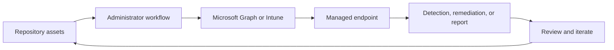

<!-- unified-readme:start -->
<div align="center">

# Intune Scripts

**A curated collection of PowerShell (and Python) scripts for Microsoft Intune administration, automation, and device management.**

Script. Deploy. Automate.

[](https://github.com/JayRHa/IntuneScripts/stargazers)
[](https://github.com/JayRHa/IntuneScripts/network/members)
[](https://github.com/JayRHa/IntuneScripts/issues)
[](https://github.com/JayRHa/IntuneScripts/graphs/contributors)

[](https://docs.microsoft.com/powershell/)
[](https://endpoint.microsoft.com)
[](https://graph.microsoft.com)
<p>
  <a href="https://jannikreinhard.com/">Blog</a> ·
  <a href="https://www.linkedin.com/in/jannik-r/">LinkedIn</a> ·
  <a href="https://x.com/jannik_reinhard">X</a>
</p>

---

`Endpoint Management` | `PowerShell` | `Public` | `Maintained`

</div>

## What is this?

Intune Scripts supports Microsoft Intune and endpoint management workflows such as automation, troubleshooting, remediation, deployment, or reporting.

## Project Context

- Use it when Intune work should be scripted, packaged, synchronized, or made easier to repeat.
- Most workflows start from repository assets, then move through Microsoft Graph, Intune, or device-side execution.
- This repository is maintained as a practical project and reference asset.

## How It Works

The repository stores scripts or tooling, administrators configure or run them, Intune and Microsoft Graph apply the work, and endpoint results feed back into reports or follow-up actions.



---
<!-- unified-readme:end -->

## Overview

This repository contains **40+ ready-to-use scripts** for Intune administrators covering:

- **Device Management** -- Change device categories, remove primary users, sync kiosk assignments
- **Proactive Remediations** -- Disk cleanup, pending reboot detection, taskbar customization, toast notifications
- **Reporting & Analytics** -- Enrollment reports, app inventory, compliance anomaly detection, Windows 11 readiness
- **Autopilot** -- Prerequisite checks, ESP detection, deployment wave groups
- **Automation** -- Azure Automation runbooks for group management, assignment monitoring, filter deployment
- **Diagnostics** -- IME log analysis (with AI summarization), MDM diagnostic log parsing, speed tests
- **UX Customization** -- Desktop shortcuts, system tray tools, context menu changes, taskbar alignment

---

## Repository Structure

| Folder | Category | Description |
|---|---|---|
| `Add-CertificateToTrustedStore/` | Device Config | Deploy certificates to Trusted Publisher store via OMA-URI |
| `Change-DeviceCategory/` | Device Mgmt | Assign device categories (single & bulk) |
| `Change-ImeLogLevel/` | Diagnostics | Toggle IME log verbosity and restart the service |
| `Change-Windows11ContextMenu/` | UX | Revert Windows 11 right-click menu to classic style |
| `Check-AutopilotPrerequisites/` | Autopilot | Full network, TPM, OS, and NTP diagnostic for Autopilot |
| `Collect-CustomInventory/` | Inventory | Client-side telemetry collection via Azure Function to Log Analytics |
| `Copy-DeviceConfigurationProfile/` | Device Config | Duplicate an existing Intune configuration profile |
| `Create-AadGroupFromEaScript/` | Automation | Dynamic AAD groups based on Endpoint Analytics script output |
| `Create-AssignmentGroupsForNewApps/` | Automation | Auto-create Available/Required/Uninstall groups for new apps |
| `Create-DesktopShortcut/` | UX | Deploy/detect/remove website shortcuts on public desktop |
| `Create-IntuneSystemtray/` | UX | System tray icon with IT quick-actions (sync, diagnostics, etc.) |
| `Create-WaveDeplyomentGroups/` | Automation | Percentage-based wave deployment group distribution |
| `Deploy-DefaultFilter/` | Device Config | Create a standard set of Intune assignment filters |
| `Get-AllAadGroupAssignments/` | Reporting | List all Intune assignments for a given AAD group |
| `Get-AllAssignmentsError/` | Reporting | Export failed config profile & app assignments to CSV |
| `Get-AllDeviceAssignments/` | Reporting | Show all assignments targeting a specific device |
| `Get-CleanUpDisk/` | Remediation | Detect low disk space and run automated cleanup |
| `Get-ConnectedDevices/` | Detection | Detect specific PnP device connections |
| `Get-DeviceAppInventory/` | Inventory | Export detected apps per device to Log Analytics or JSON |
| `Get-EspDetection/` | Autopilot | Detect whether ESP is currently active (two methods) |
| `Get-GraphExportApiReport/` | Reporting | Trigger and download Intune export API reports |
| `Get-IMEChange/` | Diagnostics | Monitor IME binary changes with hash baseline and toast alerts |
| `Get-IntuneApplicationInstallationAnomaly/` | Analytics | Anomaly detection on app install failures via Azure AI |
| `Get-IntuneBlueScreenAnomaly/` | Analytics | Anomaly detection on BSOD rates via Azure AI |
| `Get-IntuneComplianceAnomaly/` | Analytics | Anomaly detection on compliance drift via Azure AI |
| `Get-IntuneDataScience/` | Analytics | EDA report on managed devices using Pandas + Sweetviz |
| `Get-IntuneStatus/` | Reporting | Quick tenant status overview (device counts, sync dates) |
| `Get-MdmDiagnostigLogs/` | Diagnostics | Parse MDM diagnostic XML into structured PowerShell objects |
| `Get-NewEnrolledDevicesReport/` | Reporting | Email report of devices enrolled in the past 7 days |
| `Get-PendingReboot/` | Remediation | Detect pending reboots and show toast notification |
| `Get-Top5FailedAppInstallations/` | Reporting | Teams webhook alert for top 5 failing app installs |
| `Get-UnassignedAppsAndConfigurations/` | Reporting | Find apps/configs with no assignments |
| `Get-Windows11Report/` | Reporting | HTML report with Chart.js pie chart of Win11 adoption |
| `Hide-TaskViewWidgetsAndSearch/` | Remediation | Hide Task View, Widgets, and Search from taskbar |
| `Ime-LogSummarizer/` | Diagnostics | AI-powered IME log analysis (local & remote, Python) |
| `Make-Speedtest/` | Diagnostics | Download speed test with Log Analytics upload |
| [`ManagementImprovements/`](ManagementImprovements/README.md) | Tenant Mgmt | 10 housekeeping scripts: stale/duplicate devices, config backup, empty groups, unused filters, BitLocker escrow, app success rate, unassigned scripts, tenant health, policy conflicts |
| `Move-Windows11Taskbar/` | Remediation | Set Windows 11 taskbar alignment to left |
| `Remove-ApplicabilityRule/` | Device Config | Strip OS applicability rules from all config profiles |
| `Remove-PrimaryUserFromIntuneDevices/` | Device Mgmt | Remove primary user from managed devices |
| `Sync-KioskAssignmentWithAadGroup/` | Automation | Sync AAD group members into Kiosk profile user lists |
| `Sync-SecWithDistributionGroup/` | Automation | Mirror security group members to Exchange distribution groups |
| `Translate-DeivceAndUserGroups/` | Automation | Migrate user/device membership between AAD groups |
| `Write-ToastSurveyLogAnalytics/` | Remediation | Toast survey with response logging to Log Analytics |

---

## Prerequisites

- **PowerShell 5.1+** (Windows PowerShell) or **PowerShell 7+**
- **Microsoft Graph PowerShell SDK** (`Install-Module Microsoft.Graph`)
- **Azure AD / Entra ID permissions** appropriate to each script (see individual script headers)
- For Python scripts: **Python 3.9+** with `msal`, `requests`, `pandas`, `sweetviz`, `openai`

## Quick Start

```powershell
# Clone the repository
git clone https://github.com/JayRHa/IntuneScripts.git
cd IntuneScripts

# Example: Check Autopilot prerequisites on a device
.\Check-AutopilotPrerequisites\Check-AutopilotPrerequisites.ps1

# Example: Get all assignments for a specific AAD group
.\Get-AllAadGroupAssignments\Get-AllAadGroupAssignments.ps1

# Example: Deploy default Intune filters
.\Deploy-DefaultFilter\Deploy-DefaultFilter.ps1
```

## Authentication

Scripts use different authentication methods depending on their execution context:

| Method | Use Case | Scripts |
|---|---|---|
| `Connect-MgGraph` (interactive) | Admin-run scripts | Deploy-DefaultFilter, Get-AllAadGroupAssignments, etc. |
| Client Credentials (App Registration) | Azure Automation runbooks | Create-AadGroupFromEaScript, Get-AllAssignmentsError, etc. |
| Managed Identity | Azure Functions / Automation | Collect-CustomInventory, Get-Windows11Report, etc. |
| MSAL Device Code (Python) | Data science notebooks | Get-IntuneDataScience |

## Script Categories

### Proactive Remediations (Detection + Remediation pairs)

Upload the Detection and Remediation scripts as a pair in the Intune portal:

| Script Pair | Purpose |
|---|---|
| `Get-CleanUpDisk/` | Detect low disk space, run Windows Disk Cleanup |
| `Get-PendingReboot/` | Detect pending reboot, show toast notification |
| `Hide-TaskViewWidgetsAndSearch/` | Detect visible taskbar elements, hide them |
| `Move-Windows11Taskbar/` | Detect centered taskbar, move to left |
| `Collect-CustomInventory/` | Collect device telemetry, POST to Azure Function |

### Azure Automation Runbooks

These scripts are designed to run on a schedule in Azure Automation:

| Script | Purpose |
|---|---|
| `Create-AadGroupFromEaScript/` | Dynamic groups from Endpoint Analytics data |
| `Create-AssignmentGroupsForNewApps/` | Auto-create assignment groups for new apps |
| `Sync-KioskAssignmentWithAadGroup/` | Sync kiosk profile users from AAD group |
| `Get-NewEnrolledDevicesReport/` | Weekly enrollment email report |
| `Get-AllAssignmentsError/*AppRegistration.ps1` | Email CSV of failed assignments |

## Exit Codes

All detection and remediation scripts follow this convention:

| Code | Meaning |
|---|---|
| `0` | Success / Compliant (no remediation needed) |
| `1` | Runtime error / Non-compliant (remediation needed) |

## Contributing

1. Fork the repository
2. Create a feature branch
3. Follow existing naming conventions (`Verb-Noun/Verb-Noun.ps1`)
4. Include a comment-based help header with `.SYNOPSIS`, `.DESCRIPTION`, and `.NOTES`
5. Add proper error handling (`try/catch`) and exit codes
6. Submit a Pull Request

## Author

**Jannik Reinhard** -- [Blog](https://jannikreinhard.com) | [X](https://x.com/jannik_reinhard) | [GitHub](https://github.com/JayRHa)
